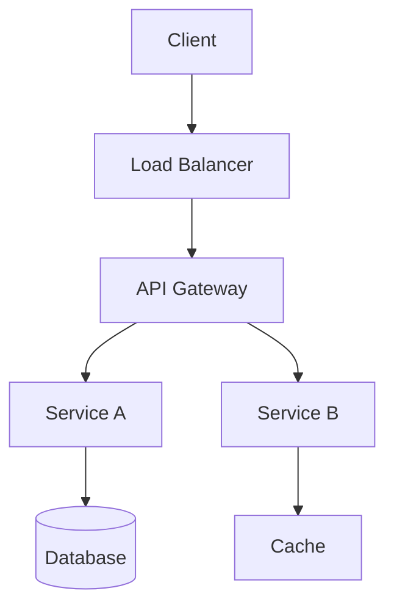
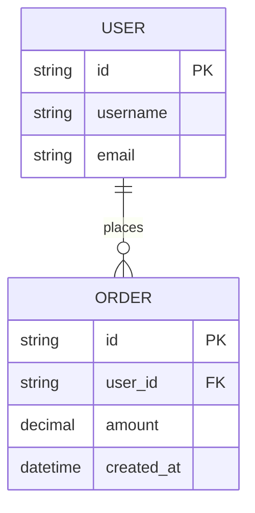
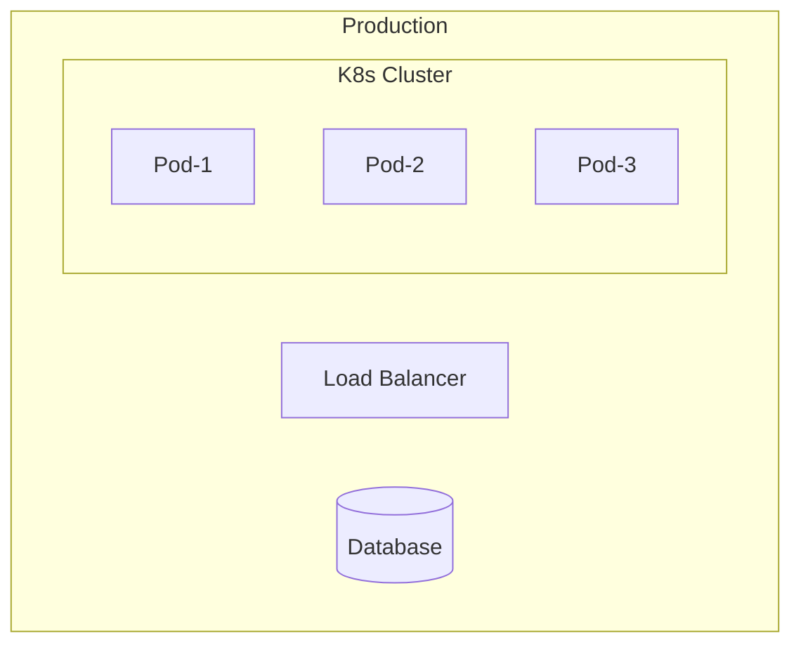

# Architecture Design Document Template

```markdown
# Architecture Design Document

## 1. Document Info
| Field | Value |
|-------|-------|
| Version | v1.0.0 |
| Date | YYYY-MM-DD |
| Author | Name |
| Status | Draft/Review/Approved |

## 2. Background & Goals

### 2.1 Project Background
Describe the problem being solved and business context.

### 2.2 Design Goals
- **Functional goals**: Core features to implement
- **Non-functional goals**:
  - Performance (QPS, latency)
  - Availability (SLA, recovery time)
  - Scalability requirements
  - Security requirements

## 3. Glossary
| Term | Definition |
|------|------------|
| Term A | Definition |
| Term B | Definition |

## 4. System Architecture

### 4.1 Architecture Overview


### 4.2 Module Division
| Module | Responsibility | Tech Stack |
|--------|---------------|------------|
| Module A | Description | Tech A, Tech B |
| Module B | Description | Tech C, Tech D |

### 4.3 Module Interactions
Describe call relationships and communication methods.

## 5. Tech Selection

### 5.1 Selection Decisions
| Component | Choice | Alternatives | Reason |
|-----------|--------|--------------|--------|
| Database | PostgreSQL | MySQL | Reason |
| Cache | Redis | Memcached | Reason |

### 5.2 Architecture Decision Records (ADR)

#### ADR-001: Database Selection
- **Status**: Accepted
- **Context**: Need to choose suitable database
- **Decision**: Use PostgreSQL
- **Reason**: Supports complex queries, good transaction integrity
- **Impact**: Team needs to learn PostgreSQL features

## 6. Data Model

### 6.1 ER Diagram


### 6.2 Core Entities
| Entity | Description | Key Fields |
|--------|-------------|------------|
| User | User entity | id, username, email |
| Order | Order entity | id, user_id, amount |

## 7. Interface Design

### 7.1 Internal Interfaces
Inter-module communication definitions.

### 7.2 External Interfaces
API overview (link to detailed API docs).

## 8. Non-functional Design

### 8.1 Performance
- Caching strategy
- Database optimization
- Async processing

### 8.2 Security
- Authentication & authorization
- Data encryption
- Security audit

### 8.3 High Availability
- Failover
- Rate limiting & degradation
- Monitoring & alerts

## 9. Deployment Architecture

### 9.1 Deployment Topology


### 9.2 Environment Config
| Environment | Config | Purpose |
|-------------|--------|---------|
| Dev | Single instance | Local development |
| Test | Dual instance | Functional testing |
| Prod | Multi-instance + LB | Production |

## 10. Risk Assessment
| Risk | Impact | Probability | Mitigation |
|------|--------|-------------|------------|
| Risk A | High | Medium | Measure |
| Risk B | Medium | Low | Measure |

## 11. Appendix
- References
- Related document links
- Revision history
```
