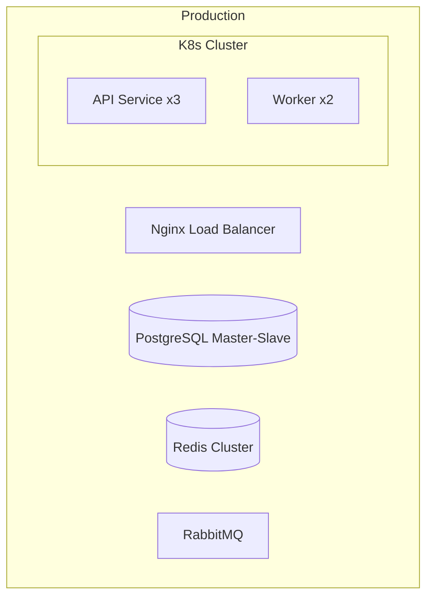

# Deployment & Operations Template

```markdown
# Deployment & Operations Guide

## 1. Deployment Architecture

### 1.1 Architecture Diagram


### 1.2 Resource Requirements
| Component | CPU | Memory | Storage | Instances |
|-----------|-----|--------|---------|-----------|
| API Service | 2 cores | 4GB | - | 3 |
| Worker | 1 core | 2GB | - | 2 |
| PostgreSQL | 4 cores | 8GB | 100GB | 2 |
| Redis | 2 cores | 4GB | - | 3 |

## 2. Environment Configuration

### 2.1 Environment Variables
| Variable | Required | Description | Example |
|----------|----------|-------------|---------|
| NODE_ENV | Yes | Environment | production |
| DATABASE_URL | Yes | DB connection | postgres://... |
| REDIS_URL | Yes | Redis connection | redis://... |
| JWT_SECRET | Yes | JWT secret | - |
| LOG_LEVEL | No | Log level | info |

### 2.2 Config File
```yaml
# config/production.yaml
app:
  port: 3000
  logLevel: info

database:
  pool:
    min: 5
    max: 20
  timeout: 30000

redis:
  cluster:
    enabled: true
    nodes:
      - redis-1:6379
      - redis-2:6379
```

## 3. Deployment Process

### 3.1 First Deployment
```bash
# 1. Create namespace
kubectl create namespace production

# 2. Create configs
kubectl apply -f k8s/configmap.yaml
kubectl apply -f k8s/secrets.yaml

# 3. Deploy database
kubectl apply -f k8s/postgres.yaml

# 4. Wait for DB ready
kubectl wait --for=condition=ready pod -l app=postgres

# 5. Run migrations
kubectl apply -f k8s/migrate-job.yaml

# 6. Deploy app
kubectl apply -f k8s/deployment.yaml
kubectl apply -f k8s/service.yaml
kubectl apply -f k8s/ingress.yaml

# 7. Verify
kubectl get pods -n production
kubectl logs -l app=api -n production
```

### 3.2 Rolling Update
```bash
# Update image
kubectl set image deployment/api api=myapp:v1.1.0 -n production

# Monitor progress
kubectl rollout status deployment/api -n production

# View history
kubectl rollout history deployment/api -n production

# Rollback if needed
kubectl rollout undo deployment/api -n production
```

## 4. Monitoring & Alerts

### 4.1 Metrics
| Metric | Threshold | Severity |
|--------|-----------|----------|
| CPU > 80% | Warning | |
| Memory > 85% | Warning | |
| Disk > 80% | Critical | |
| API latency > 500ms | Warning | |
| Error rate > 1% | Critical | |

### 4.2 Alert Config
```yaml
# prometheus-rules.yaml
groups:
  - name: api-alerts
    rules:
      - alert: HighErrorRate
        expr: rate(http_requests_total{status=~"5.."}[5m]) > 0.01
        for: 2m
        labels:
          severity: critical
        annotations:
          summary: "High API error rate"
          description: "Error rate exceeds 1%"
```

## 5. Log Management

### 5.1 Log Collection
```yaml
# fluentd-config.yaml
<source>
  @type tail
  path /var/log/app/*.log
  tag app.log
  <parse>
    @type json
  </parse>
</source>

<match app.log>
  @type elasticsearch
  host elasticsearch
  port 9200
</match>
```

### 5.2 Log Queries
```bash
# Real-time logs
kubectl logs -f deployment/api -n production

# Last hour
kubectl logs deployment/api --since=1h -n production

# Search errors
kubectl logs deployment/api | grep ERROR
```

## 6. Backup & Recovery

### 6.1 Database Backup
```bash
#!/bin/bash
# backup.sh
BACKUP_DIR="/backup/postgres"
DATE=$(date +%Y%m%d_%H%M%S)

# Backup
pg_dump -h postgres -U postgres mydb > $BACKUP_DIR/backup_$DATE.sql

# Keep 7 days
find $BACKUP_DIR -name "backup_*.sql" -mtime +7 -delete
```

### 6.2 Data Recovery
```bash
# Restore database
psql -h postgres -U postgres mydb < backup_20240101_000000.sql

# Verify
psql -h postgres -U postgres -c "SELECT COUNT(*) FROM users;"
```

## 7. Troubleshooting

### 7.1 Service Unavailable
1. Check pod status:
   ```bash
   kubectl get pods -n production
   kubectl describe pod <pod-name> -n production
   ```

2. View logs:
   ```bash
   kubectl logs <pod-name> -n production --previous
   ```

3. Check resources:
   ```bash
   kubectl top pod -n production
   ```

### 7.2 Database Connection Issues
1. Check DB service:
   ```bash
   kubectl get svc postgres -n production
   kubectl exec -it postgres-0 -n production -- pg_isready
   ```

2. Check connection pool:
   ```sql
   SELECT count(*), state FROM pg_stat_activity GROUP BY state;
   ```

### 7.3 Performance Issues
1. View slow queries:
   ```sql
   SELECT query, mean_exec_time 
   FROM pg_stat_statements 
   ORDER BY mean_exec_time DESC 
   LIMIT 10;
   ```

## 8. Security Checklist

- [ ] Database uses strong passwords
- [ ] Sensitive configs use Secrets
- [ ] API uses HTTPS
- [ ] Dependencies updated regularly
- [ ] Access logs enabled
- [ ] Network policies configured
- [ ] Regular security scans

## 9. Maintenance Schedule

| Task | Frequency | Window |
|------|-----------|--------|
| Security updates | As needed | 2-4 AM |
| DB backup | Daily | 3 AM |
| Log cleanup | Weekly | Sunday midnight |
| Performance optimization | Monthly | As needed |
```
