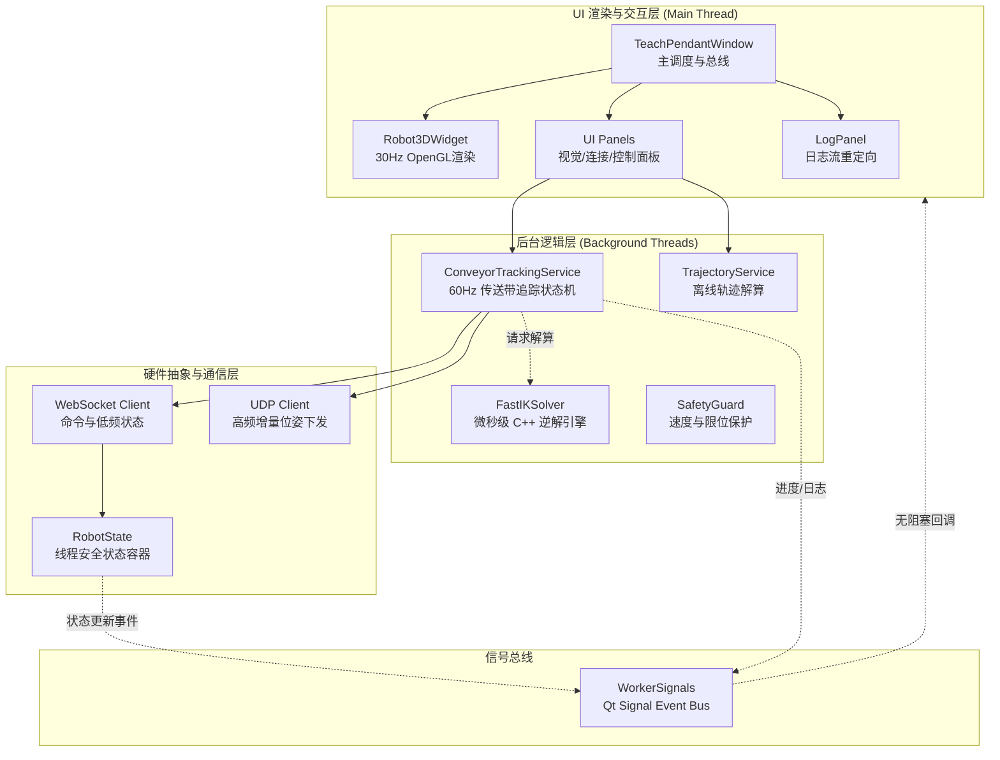
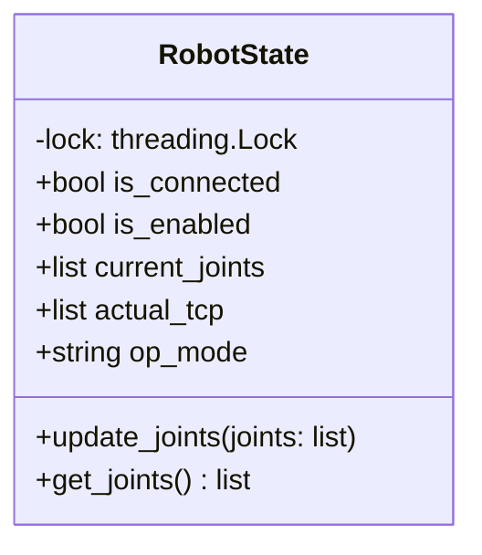

# 架构设计文档

## 1. 文档信息

| 字段 | 值 |
|------|-----|
| 版本 | v1.0.0 |
| 日期 | 2026-02-28 |
| 作者 | 开发团队 |
| 状态 | 已发布 |

## 2. 背景与目标

### 2.1 项目背景

KAANH 仿真孪生示教器旨在提供一个综合性的桌面平台，用于工业机器人的配置、控制、轨迹规划与高级视觉伺服测试。传统示教器往往交互繁琐且缺乏三维可视化预览，本项目通过引入 3D 数字孪生与双通道实时通信，大幅降低了机器人的调试与部署门槛。

### 2.2 设计目标

**功能性目标**：
- 实现基于 3D 渲染的所见即所得 (WYSIWYG) 机器人位姿预览
- 支持基础点动 (Jogging) 与离线轨迹加载执行
- 提供带前馈补偿的动态传送带视觉抓取流水线

**非功能性目标**：
- **实时性**：3D 渲染频率稳定在 30Hz；底层跟随控制延迟低于 5ms (利用 UDP)
- **稳定性**：UI 线程绝不能被复杂的硬件通信与重计算阻塞
- **可扩展性**：采用面向服务 (SOA) 和组件化 UI 设计，方便后续接入新的传感器控制面板

## 3. 术语表

| 术语 | 定义 |
|------|------|
| 数字孪生 (Digital Twin) | 在虚拟空间中构建物理实体的实时动态映射模型 |
| Follower Mode | 控制器提供的高速低延迟随动控制模式，通常通过 UDP 下发笛卡尔或关节增量 |
| TCP | Tool Center Point，机器人工具中心点，本文档常指法兰末端中心 |
| IK (Inverse Kinematics) | 逆运动学，根据目标笛卡尔坐标求解机器人的各关节角度 |

## 4. 系统架构

### 4.1 架构概览

### 4.2 模块划分

| 模块 | 职责 | 核心技术栈 |
|------|------|-----------|
| `ui` | 提供各种交互面板，收集用户意图并触发对应的服务 | PyQt5 |
| `render` | 加载 URDF/DH 模型，根据实时关节角进行前向计算并更新 3D 场景 | PyVista, OpenGL |
| `logic` | 承载繁重的状态机运转、轨迹插补计算及硬件交互流水线 | Python threading, FastIK |
| `core` | 封装全生命周期的硬件状态字典与安全防护策略 | Python |
| `robot_controller` | 屏蔽底层协议细节，暴露统一的运动/通信 API | WebSocket, socket (UDP) |

### 4.3 模块交互机制

系统采用 **信号驱动模式 (Signal-Driven)** 来解决多线程 UI 更新问题。

**自顶向下**：UI 面板捕获点击事件后，将参数传递给 `logic` 层的相关 Service。Service 随后会启动独立的 `threading.Thread` 开始执行长效任务。

**自底向上**：由于 `PyQt` 禁止在非主线程中更新界面，当底层硬件通过 `robot_controller` 收到新的关节角，或 Service 中产生了新的执行进度时，会通过 `WorkerSignals` 触发 `emit()`，主窗口在接收到信号后调用相应的 UI 更新函数（如重绘 3D 场景或更新状态栏）。

## 5. 技术选型

### 5.1 选型决策

| 组件 | 选型 | 备选方案 | 选型理由 |
|------|------|----------|----------|
| UI 框架 | PyQt5 | Tkinter, PySide6 | 工业界应用最广，文档完备，支持复杂的自定义 Widget 与样式 (QSS) |
| 3D 渲染库 | PyVista (VTK) | Matplotlib 3D | PyVista 底层基于 VTK，渲染性能远超 Matplotlib，且能轻松处理复杂的 STL Mesh 组装和高频刷新 |
| 通信协议 | WebSocket + UDP | 纯 TCP Socket | WebSocket 适合低频结构化命令（JSON）；UDP 无握手开销，是实现 2-5ms 高速笛卡尔跟随的唯一解 |

### 5.2 架构决策记录 (ADR)

#### ADR-001: 复杂的流水线任务异步化与解耦

- **状态**：已实施
- **背景**：早期版本中，轨迹循环发送直接写在 UI 类的槽函数内，导致执行轨迹时界面完全卡死（无响应），引发系统被强杀的风险
- **决策**：引入 `WorkerSignals` 全局通信总线。所有耗时的方法（特别是包含 `time.sleep` 的轨迹控制与 `conveyor_tracking_service` 状态机）全部独立为 Service 层，并强制要求由 `threading.Thread` 唤起
- **影响**：极大提升了界面的流畅度，但对开发者的约束更高，即严禁从后台线程直接修改 UI 属性

## 6. 数据模型

### 6.1 核心状态容器 (`RobotState`)

为了在多线程环境下保证数据读写的安全性，采用了读写锁 (Lock) 机制进行保护。

### 6.2 状态属性说明

| 属性 | 类型 | 说明 |
|------|------|------|
| is_connected | bool | WebSocket 连接状态 |
| is_enabled | bool | 机器人使能状态 |
| is_logged_in | bool | 登录状态 |
| current_joints | list[float] | 当前关节角度（6轴）|
| actual_tcp | list[float] | 当前 TCP 位姿 [x,y,z,rx,ry,rz] |
| op_mode | str | 操作模式（手动/自动）|

## 7. 接口设计

### 7.1 内部通信接口 (WorkerSignals)

`teach_pendant.signals.WorkerSignals` 继承自 `QObject`，定义了后台向 UI 层通讯的规范：

| 信号 | 参数 | 用途 |
|------|------|------|
| `joints_updated` | list | 关节位置更新 |
| `status_updated` | str | 状态消息通知 |
| `connection_changed` | bool, str | 连接状态变化 (connected, port_type) |
| `command_finished` | bool, str | 命令执行完成 (success, message) |
| `error_occurred` | str | 错误发生通知 |
| `robot_status_updated` | dict | 机器人详细状态更新 |
| `tracking_error_updated` | float, float | 跟踪误差 (线性误差 mm, 姿态误差 deg) |
| `log_message` | str | 日志消息 |

### 7.2 硬件网关层 (RobotController)

对控制器协议进行二次封装，对外提供的方法包括但不限于：

- `connect_ws(ip)` / `connect_udp()`
- `move_joint(joints, vels, wait_for_finish)`
- `start_follower_mode()` / `cmd_stop_follower()`

## 8. 非功能性设计

### 8.1 性能与容错设计

**防日志风暴 (Log Storm Prevention)**：在重定向 `sys.stdout` 至 UI 面板时，`StreamRedirector` 内部加锁，丢弃高频的并发递归写入，防止 GUI 卡死。

**动态频率控制**：在离线轨迹的 `_run_points_sequence` 中，使用 `time.perf_counter()` 获取高精度时钟，进行休眠时间的动态补偿，抵消 IK 计算与网络 I/O 带来的时间消耗。

### 8.2 安全设计

**SafetyGuard 拦截器**：拦截下发前的位置/速度数据。如果检测到增量过大（可能导致物理撞机或超出驱动器限制），主动切断通信并触发报警信号。

## 9. 附录

- 参考资料：PyQt5 官方文档，PyVista API Reference
- 相关文档链接：[开发指南](./DEVELOPMENT.md)
