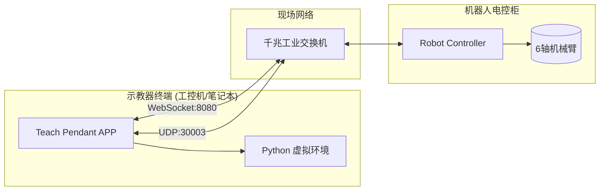

# 部署运维文档

## 1. 部署架构

### 1.1 架构图

KAANH 示教器虽然是一个基于 PyQt 的桌面端应用程序，但在工业现场使用时，通常部署在工控机（IPC）、工业平板或调试笔记本上，并通过专用的局域网与机器人控制器建立低延迟的数据链路。



### 1.2 资源需求

| 组件 | CPU | 内存 | 存储 | 网络 |
|------|-----|------|------|------|
| 示教器终端 | i5 或更高 | 8GB | 10GB | 千兆有线网卡 |

## 2. 环境配置

### 2.1 硬件配置推荐

| 组件 | 推荐配置 | 用途 |
|------|----------|------|
| 处理器 | Intel Core i5 或更佳 | 保证 IK 计算（逆运动学解算）耗时控制在微秒级 |
| 内存 | 8 GB RAM 或更高 | 支持大型 CSV 轨迹点加载及 3D 模型缓存 |
| 显卡 | 独立显卡 或 Intel UHD 核心显卡 | PyVista (OpenGL) 需要一定的显卡支持以保证 3D 渲染在 30Hz 流畅运行 |
| 网络 | 千兆有线网卡 | UDP 高频数据下发需要稳定的、无丢包的局域网环境（禁止使用 Wi-Fi 连接真实设备进行跟随控制！） |

### 2.2 系统与依赖环境

1. **操作系统**：Windows 10 / 11 64位（工业平板首选）
2. **运行环境**：Python 3.8 ~ 3.10

## 3. 部署流程

### 3.1 离线环境安装方案

由于大多数工厂车间是内网隔离的（无互联网），你需要在一台联网电脑上打包依赖，然后在工控机上离线安装。

**在一台有网的电脑上（制作离线包）：**

```bash
# 1. 准备 requirements.txt
mkdir packages
# 2. 下载所有依赖及轮子文件到 packages 文件夹
pip download -r requirements.txt -d ./packages
# 将整个源码包和 packages 文件夹拷贝到 U盘
```

**在现场工控机上（无网安装）：**

```bash
# 1. 拷贝源码和 packages 到现场机器
cd python-robotics-sim
# 2. 离线安装依赖
pip install --no-index --find-links=./packages -r requirements.txt
```

### 3.2 启动程序配置

可以编写一个批处理文件 (`start.bat`) 放在桌面，方便现场操作人员一键启动。

**`start.bat` 示例：**

```bat
@echo off
echo 正在启动 KAANH 示教器...
cd /d "D:\your_path\python-robotics-sim"
REM 如果使用了 conda 虚拟环境
call conda activate robosim
python -m teach_pendant.app
pause
```

## 4. 网络配置与安全策略

### 4.1 网络隔离要求

强烈建议将机器人系统置于一个**独立的子网**内（例如 `192.168.1.x`）。

- **工控机 IP 设置**：设置固定 IP（如 `192.168.1.100`）
- **控制器 IP**：确认识别控制器 IP（如 `192.168.1.10`）
- 禁用工控机上此网卡的防火墙，防止 UDP 端口接收被阻断

### 4.2 高速随动 (Follower Mode) 稳定性保障

当启用视觉追踪的 `UDP 跟随模式` 时：

1. **绝对禁止**在网络链路中使用集线器（Hub），必须使用工业级交换机（Switch）
2. **系统休眠**：在 Windows 系统设置中，**禁用**"允许计算机关闭此设备以节约电源"（针对有线网卡）
3. 如果 3D 界面存在卡顿，请勿随意拖拽窗口边框。Windows UI 拖拽时会短暂挂起其他线程，可能会导致底层 100Hz UDP 下发超时（看门狗报警）

## 5. 监控告警

### 5.1 关键指标监控

| 指标 | 告警阈值 | 级别 |
|------|----------|------|
| UDP 丢包率 | > 1% | 警告 |
| 3D 渲染帧率 | < 20Hz | 警告 |
| 控制指令延迟 | > 10ms | 严重 |
| 内存使用率 | > 90% | 警告 |

### 5.2 日志监控

示教器的日志输出被重定向到 UI 的 LogPanel，同时也写入到控制台。建议：

- 定期检查日志中的错误和警告信息
- 对于长时间运行的场景，建议定期清理日志缓冲区

## 6. 故障处理

### 6.1 程序启动时 3D 视图发黑或闪退

**症状**：启动 `app.py` 时直接崩溃，日志无 Python 层面的报错信息

**原因**：工控机显卡驱动未正确安装，或者不支持 OpenGL

**解决**：更新显卡驱动，或者在启动前尝试设置环境变量强制使用软件渲染（此方案可能严重降低性能）：

```bat
set LIBGL_ALWAYS_SOFTWARE=1
python -m teach_pendant.app
```

### 6.2 WebSocket 能连上，但 UDP 轨迹执行报错 / 机器人不动作

**症状**：点动/连接等基础功能正常，一旦下发 UDP 增量轨迹便报错

**排查路径**：

1. **状态检查**：确认机器人是否已经完成使能？
2. **协议限制**：部分控制器要求在启动 Follower 模式前必须处在原点附近或安全姿态。查看终端标准输出是否有 `TCP 不匹配` 等日志
3. **端口占用**：工控机本地是否有其他软件占用了 UDP 发送/接收端口

### 6.3 UI 界面偶发性失去响应，需要强杀进程

**原因分析**：通常是由大量且高频的警告日志灌入 `LogPanel` 导致了 GUI 渲染线程的死锁（防递归机制虽有但不能应付极端堆栈）

**应急处理**：如果不需要看日志，可以在 `main_window.py` 内部 `_setup_log_redirection` 函数中注释掉 `sys.stdout = StreamRedirector(...)` 这一行，彻底恢复到控制台打印

### 6.4 连接中断/自动重连

示教器内置了自动重连机制：

- 当 WebSocket 连接断开时，监控线程会尝试自动重连
- 重连成功后会自动恢复登录和使能状态
- 如果频繁断连，请检查网络稳定性

## 7. 安全检查清单

- [ ] 机器人系统部署在独立子网
- [ ] 工控机防火墙已正确配置（或禁用相关网卡的防火墙）
- [ ] 使用千兆工业交换机，禁止使用 Hub 或 Wi-Fi
- [ ] 网卡电源管理已禁用（不允许关闭设备以节约电源）
- [ ] 示教器软件版本与控制器固件版本兼容
- [ ] 现场操作人员已完成基本操作培训

## 8. 维护窗口

| 维护项 | 频率 | 时间窗口 |
|--------|------|----------|
| 软件更新 | 按需 | 生产间隙 |
| 日志清理 | 每周 | 周末 |
| 网络检测 | 每月 | 计划维护时间 |
| 性能优化 | 按需 | 计划维护时间 |
