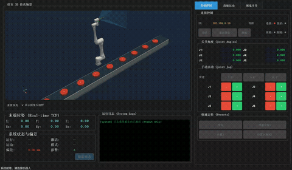

# KAANH_Digital_Twin 机器人数字孪生仿真平台


## 一句话简介

KAANH_Digital_Twin 是一个基于 PyQt5 的机器人数字孪生仿真平台，集成了 3D 实时渲染、视觉伺服控制、轨迹规划与硬件通信功能。

## 功能特性

- **实时 3D 孪生仿真**：内置 30Hz 刷新率的 3D 渲染视图，支持机器人姿态实时反馈、摄像头视野 (FOV) 预览与运动轨迹可视化
- **多模态运动控制**：支持通过 WebSocket 进行基础关节/笛卡尔控制，以及通过 UDP 协议实现 2-5ms 级低延迟高速随动控制 (Follower Mode)
- **视觉伺服与传送带追踪**：内置 60Hz 高频状态机与 FastIK 微秒级逆解引擎，支持动态目标识别、前馈补偿悬停与精准抓取
- **工业级沉浸 UI**：采用 Dark Fusion 主题，模块化面板设计（基础控制、高级运动、视觉引导），专为工业平板环境优化

## 技术栈

| 技术 | 版本 | 用途 |
|------|------|------|
| Python | >=3.8 | 核心开发语言 |
| PyQt5 | ^5.15 | 图形用户界面开发 |
| PyVista/OpenGL | - | 3D 模型渲染与运动仿真 |
| FastIK (C++ Binding) | - | 机器人正逆运动学极速解算引擎 |
| WebSocket & UDP | - | 硬件设备低延迟与高频数据通信 |

## 快速开始

### 环境要求

- Python 3.8 或更高版本
- Windows 10/11 操作系统 (推荐)
- 可用的网卡环境 (用于与控制器进行 TCP/UDP 交互)

### 安装步骤

```bash
# 1. 克隆或进入项目根目录
cd python-robotics-sim

# 2. 安装 Python 核心依赖项
pip install -r requirements.txt
# (注: 请确保包含 PyQt5, pyvista, numpy, pandas 等基础库)
```

### 启动服务

```bash
# 启动 KAANH_Digital_Twin
python -m teach_pendant.app
```

## 基本使用

1. **连接机器人**：在右侧【基础控制】选项卡的 `连接与状态` 面板输入机器人 IP，点击连接并使能
2. **3D 可视化**：左侧实时渲染机器人当前姿态。勾选或取消 `显示摄像头视野` 切换 FOV
3. **视觉追踪**：切换到【视觉引导】选项卡，加载 CSV 轨迹并利用 `UDP 增量执行` 体验自动化流水线与跟随功能

## 演示视频



> 上图展示了 KAANH_Digital_Twin 的实际运行效果：3D 数字孪生实时渲染、机器人状态监控与关节控制、视觉追踪与跟随模式演示。

📹 **[下载高清演示视频 (MP4)](assets/demo_20260228.mp4)**

## 项目结构

```text
python-robotics-sim/
├── teach_pendant/               # KAANH_Digital_Twin 核心功能与前端界面目录
│   ├── app.py                   # 应用程序入口，负责 QApplication 的初始化及深色主题样式配置
│   ├── main_window.py           # KAANH_Digital_Twin 主窗口，负责各功能面板（UI）与业务服务（Logic）的集成与跨线程调度
│   ├── robot_controller.py      # 硬件抽象网关，封装 WebSocket 基础指令与 UDP 高速指令的收发逻辑
│   ├── robot_3d_widget.py       # 3D 可视化视口，基于 PyVista 渲染机器人的实时动作与摄像头视野
│   ├── signals.py               # 信号总线中心，定义全局 PyQt 信号以实现工作线程与 UI 线程的安全通信
│   ├── config.py                # KAANH_Digital_Twin 全局静态配置与参数定义
│   ├── core/                    # [核心状态与防护模块]
│   │   ├── robot_state.py       # 线程安全的数据仓库，维护机器人的实时状态（关节角、TCP、工作模式等）
│   │   └── safety_guard.py      # 运动安全拦截器，校验运动指令的合法性（速度限制、软限位检查等）
│   ├── logic/                   # [复杂业务逻辑层]
│   │   ├── conveyor_tracking_service.py # 核心业务算法：运行于 60Hz 的 4 阶段传送带动态追踪与前馈补偿状态机
│   │   ├── trajectory_service.py        # 轨迹规划服务：离线轨迹点解析、插补算法及点位序列管理
│   │   └── vision_service.py            # 视觉交互服务：负责与外部 YOLO/相机流对接及坐标系变换
│   ├── render/                  # [底层 3D 渲染组件]
│   │   ├── robot_model.py       # 机器人运动学模型定义（DH参数）及 3D 网格 (STL) 文件加载
│   │   └── robot_renderer.py    # 核心渲染器：处理光影、网格材质、轨迹线绘制及实时位姿矩阵更新
│   └── ui/                      # [细分 UI 面板组件]
│       ├── connection_panel.py  # 连接面板：机器人 IP 登录、使能状态管理
│       ├── robot_status_panel.py# 状态面板：实时数值显示（笛卡尔坐标、关节角度、网络延迟等）
│       ├── joint_control_panel.py# 点动面板：提供各关节、笛卡尔方向的 Jogging (点动/连动) 按键
│       ├── teleop_panel.py      # 遥操作面板：映射外部手柄或按键触发 UDP 高速随动指令
│       ├── follower_panel.py    # 随动面板：一键启动 Follower 模式及底层 UDP 流状态管理
│       ├── vision_panel.py      # 视觉面板：加载 CSV 轨迹点、参数配置及触发追踪流水线
│       └── log_panel.py         # 日志面板：捕获被重定向的控制台输出，实时打印系统运行状态与错误
├── fast_ik/                     # C++ 优化的底层逆解算法封装 (供 logic 层调用)
└── docs/                        # 详细技术文档与规范指南
```

## 文档导航

- [架构设计文档](./ARCHITECTURE.md) - 系统架构、模块交互与核心设计决策
- [API 接口文档](./API.md) - 硬件通信协议(WebSocket/UDP)与内部服务接口
- [函数参考手册](./FUNCTION_REFERENCE.md) - 核心类与函数快速查阅指南
- [开发指南](./DEVELOPMENT.md) - 代码规范、新增功能面板教程与调试技巧
- [部署运维文档](./DEPLOYMENT.md) - 现场环境部署与网络排错手册

## 许可证

[MIT License](../LICENSE)
